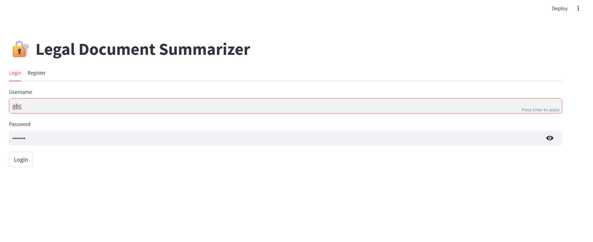
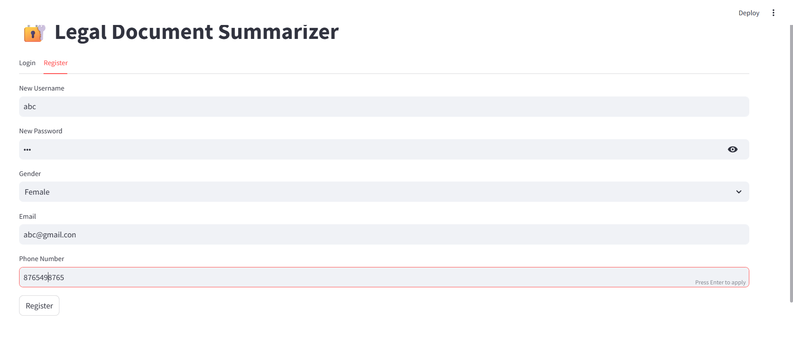
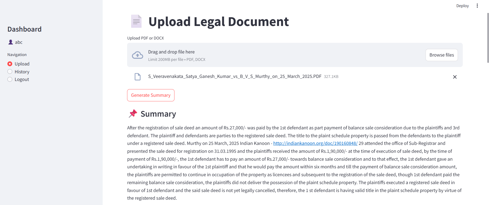
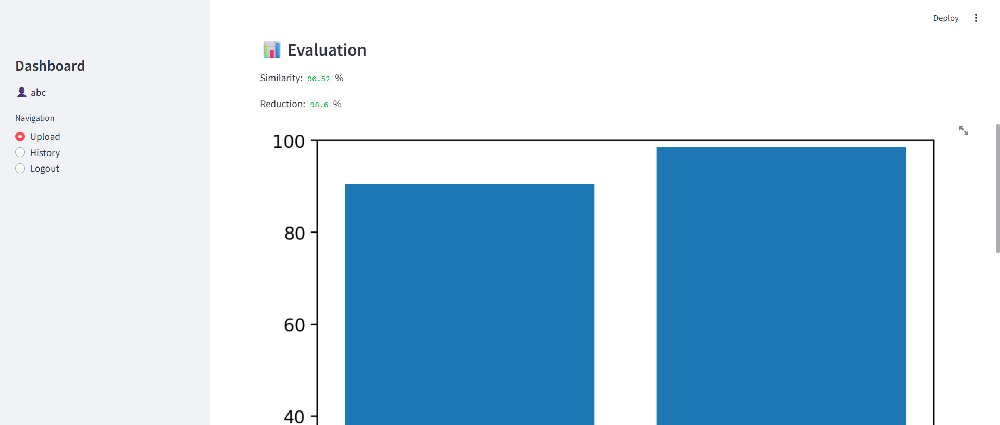
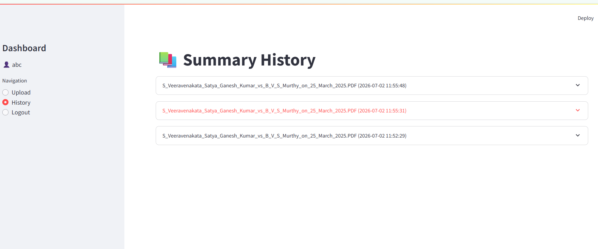

# 📄 Legal Document Summarization using NLP

## Overview

Legal Document Summarization using NLP is a Python-based web application that automatically generates concise summaries from lengthy legal documents. The system helps users quickly understand important information without reading the entire document.

## Features

- User Registration and Login
- Upload PDF and DOCX legal documents
- Automatic text extraction
- NLP-based document summarization
- Summary history
- User-specific document management
- Interactive Streamlit interface

## Technologies Used

- Python
- Streamlit
- NLTK
- SQLite
- PyPDF2
- python-docx
- Scikit-learn
- NetworkX

## 📸 Application Screenshots

### Login Page



### Registration Page



### Upload Page


### Generated Summary



### Evaluation



### Processing Time


### Download and Question Answering


### History



## Installation

```bash
pip install -r requirements.txt
streamlit run app.py
```

## Author

**Jaasmitha Murakonda**

MCA Graduate | Python Developer | NLP Enthusiast
